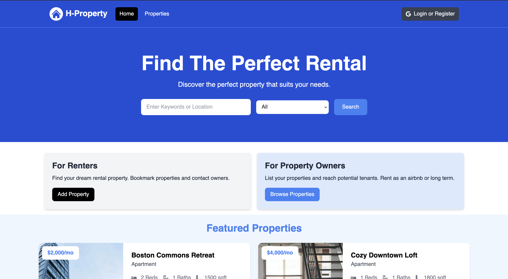

# 🏡 H-Property — Find Your Next Rental Home

[](https://h-property.vercel.app/)
[](https://nextjs.org/)
[](https://www.mongodb.com/)
[](https://tailwindcss.com/)

**H-Property** is a **modern web application** designed to help you **find your next rental property** with ease.  
Built as part of a **Udemy learning project**, it demonstrates **full-stack development skills** using **Next.js App Router** and **MongoDB**, combined with **Cloudinary** for image hosting and **Google authentication** for seamless sign-in.

> ⚠️ **Disclaimer**
>
> - All property data, images, and addresses are dummy placeholders.
> - This is **not a real estate platform**.
> - Built as part of a **Udemy course** to practice full-stack concepts.

---

## 🔗 Live Demo

🚀 **Try it here** → [https://h-property.vercel.app/](https://h-property.vercel.app/)

---

## ✨ Features

- 🏠 **Property Listings** — Browse available rental properties.
- 🔍 **Advanced Filters** — Search by location, price, and amenities.
- 🖼️ **Image Hosting via Cloudinary** — Optimized image storage and delivery.
- 🔐 **Google Sign-In** — Secure authentication using Google OAuth.
- 📡 **Next.js API Routes** — Fetch and manage property data efficiently.
- 📱 **Responsive UI** — Fully optimized for mobile, tablet, and desktop.
- 🛠️ **Full-Stack Integration** — Built using the **Next.js App Router** and **MongoDB**.

---

## 🖼️ Preview



---

## 🛠️ Tech Stack

- **Framework**: [Next.js App Router](https://nextjs.org/docs/app)
- **Frontend**: [JavaScript](https://developer.mozilla.org/en-US/docs/Web/JavaScript) + [TailwindCSS](https://tailwindcss.com/)
- **Authentication**: Google OAuth
- **Database**: [MongoDB](https://www.mongodb.com/)
- **Image Hosting**: [Cloudinary](https://cloudinary.com/)
- **API Fetching**: Built using **Next.js App Router API routes**

---

## 📌 Project Purpose

This project was built as part of a Udemy course to learn and practice:

- Next.js App Router concepts.
- Full-stack development with MongoDB.
- Authentication via Google OAuth.
- Image management using Cloudinary.
- API integration and data fetching.
- Building a responsive, user-friendly UI with TailwindCSS.

---

## 🚀 Getting Started

### 1. Clone the Repository

```bash
git clone https://github.com/H-Mohamed-Hisham/h-property.git
cd h-property
```

### 2. Install Dependencies

```bash
npm install
```

### 3. Set Up Environment Variables

Create a .env file:

```
# Next JS
NEXT_PUBLIC_DOMAIN=http://localhost:3000
NEXT_PUBLIC_API_DOMAIN=http://localhost:3000/api
NEXTAUTH_URL=http://localhost:3000
NEXTAUTH_URL_INTERNAL=http://localhost:3000
NEXTAUTH_SECRET=your_secret_message

# MongoDB
MONGODB_URI=mongo_db_uri

# Google
GOOGLE_CLIENT_ID=client_id
GOOGLE_CLIENT_SECRET=client_secret

# Cloudinary
CLOUDINARY_CLOUD_NAME=cloud_name
CLOUDINARY_API_KEY=api_key
CLOUDINARY_API_SECRET=api_secret
```

### 4. Run the Development Server

```
npm run dev
```

Your app will be running at http://localhost:3000

Built with ❤️ using Next.js, TailwindCSS, MongoDB, Cloudinary, and Google OAuth
